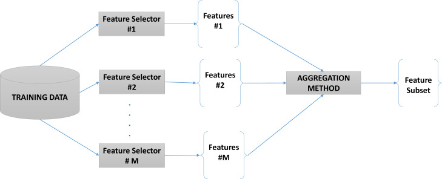

# McGill-FIAM Asset Management Hackathon — LYTA Strategy Analytics

**Running [main_notebook.ipynb](https://github.com/ThongLai/Investment-Allocation-Analysis_McGill-Hackathon/blob/main/main_notebook.ipynb):** [](https://mybinder.org/v2/gh/ThongLai/Investment-Allocation-Analysis_McGill-Hackathon/main?urlpath=%2Fdoc%2Ftree%2Fmain_notebook.ipynb)

**Technical Report: [Deck - LYTA Strategy Analytics.pdf](https://docs.google.com/viewer?url=github.com/ThongLai/Investment-Allocation-Analysis_McGill-Hackathon/blob/main/Deck%20-%20LYTA%20Strategy%20Analytics.pdf?raw=true)**

**Dataset: [McGill-FIAM Asset Management Hackathon Dataset](https://www.kaggle.com/datasets/minhthonglai/mcgill-fiam-asset-management-hackathon)**<a name="dataset" id="dataset"></a>

## Table of Contents

- [McGill-FIAM Asset Management Hackathon — LYTA Strategy Analytics](#mcgill-fiam-asset-management-hackathon--lyta-strategy-analytics)
  - [Table of Contents](#table-of-contents)
  - [Introduction](#introduction)
  - [Problem Statement](#problem-statement)
  - [Data](#data)
    - [Description](#description)
    - [Accessing the Data](#accessing-the-data)
  - [Methodology](#methodology)
    - [Data Preprocessing](#data-preprocessing)
    - [Feature Selection](#feature-selection)
    - [Predictive Modeling](#predictive-modeling)
    - [Portfolio Construction and Analysis](#portfolio-construction-and-analysis)
  - [Results](#results)
    - [Performance Metrics](#performance-metrics)
  - [Repository Structure](#repository-structure)
  - [References](#references)

---

## Introduction

This repository contains our solution for the **McGill-FIAM Asset Management Hackathon**. The hackathon challenges participants to apply machine learning (ML) techniques and data-driven approaches to design innovative portfolio trading strategies. At **LYTA Strategy Analytics**, we developed a mixed long-short investment strategy using advanced ML techniques, achieving significant performance gains over traditional market benchmarks.

---

## Problem Statement

The core objectives of the hackathon included:

1. **Machine Learning for Portfolio Construction**: Build portfolios using ML models to predict stock returns.
2. **Financial Factor Identification**: Identify key financial factors that correlate with stock performance.
3. **Optimized Stock Selection and Allocation**: Choose between 50-100 stocks and allocate investments to maximize portfolio returns.
4. **Backtesting**: Evaluate the strategy's historical performance using robust backtesting methodologies.

Participants were encouraged to innovate on methodologies, data usage, and implementation techniques.

---

## Data

### Description

The dataset spans from **January 2000 to December 2023**, covering approximately 1,000 U.S. stocks monthly. For each stock, 147 firm-specific characteristics or signals are provided, derived from over 40 years of research on predictive factors for stock returns. These characteristics include:

- **Financial Fundamentals** (e.g., market equity, price-to-book ratio)
- **Past Stock Performance**
- **Liquidity and Trading Costs**
- **Credit Risks**

**Target Variable**: Monthly stock excess returns (`stock_exret`) over the risk-free rate, lagged by one month for true predictability.

---

### Accessing the Data

Due to its large size, the dataset is hosted externally on Kaggle:

- [McGill-FIAM Asset Management Hackathon Dataset](#dataset)

The following files are crucial for this project:

- `hackathon_sample_v2.csv`: Stock data with 147 characteristics.
- `factor_char_list.csv`: List of factor names used in the dataset.
- `mkt_ind.csv`: Market factors including risk-free rate and S&P 500 monthly returns.

---

## Methodology

Our approach consisted of four main steps:

1. **Data Preprocessing**: Clean and prepare the dataset for analysis.
2. **Feature Selection**: Identify the most relevant features for predicting stock returns.
3. **Predictive Modeling**: Implement and train ML models to predict future stock returns.
4. **Portfolio Construction & Analysis**: Build and evaluate the performance of the investment strategy.

---

### Data Preprocessing

**Steps Taken**:

1. **Handling Missing Values**:
   - Retained factors with less than **30% missing values**.
   - Median imputation was used to fill smaller gaps.

2. **Handling Zero Values**:
   - Retained factors with less than **20% zero values**, as excessive zeros reduce predictability.

3. **Stock Selection**:
   - Selected stocks with the highest number of available data months.
   - Excluded stocks where all factor values were missing.

4. **Ranking and Normalization**:
   - Factors were ranked and normalized to ensure comparability across stocks.

---

### Feature Selection

We experimented with two feature selection approaches:

1. **Heterogeneous Ensembles**:

<div style="text-align: center;">
    
</div>

   - **Filter Methods**: Pearson Correlation and Mutual Information.
   - **Wrapper Methods**: Recursive Feature Elimination (RFE).
   - **Embedded Methods**: Techniques like Lasso, Elastic Net, and XGBoost Feature Importance.
   - Final features were selected using a union of the top features from all methods.

1. **Recursive Feature Elimination (RFE)**:
   - Used **XGBoost** with 500 estimators to recursively eliminate irrelevant features.
   - Selected the top **50 features** based on R-squared evaluation.

**Outcome**:
- RFE with XGBoost achieved a higher R-squared value, making it the final choice for feature selection.

---

### Predictive Modeling

**Model Used**:
- **XGBoost Regressor**: A gradient boosting algorithm optimized for structured tabular data.

**Hyperparameter Tuning**:
- Parameters like `n_estimators`, `learning_rate`, `max_depth`, `subsample`, and `colsample_bytree` were optimized using GridSearchCV.

**Training Strategy**:
- **Expanding Window Approach**:
  - Initial Training Period: 2000-2009.
  - Predictions were made for 2010 onwards, retraining the model annually.
  - Ensured predictions were truly out-of-sample by excluding future data.

---

### Portfolio Construction and Analysis

**Strategy**:
- Mixed **long-short portfolio** with:
  - **70% Long** positions (stocks predicted to perform well).
  - **30% Short** positions (stocks predicted to underperform).
- Portfolio rebalanced monthly.

**Evaluation Metrics**:
- Sharpe Ratio
- Annualized Return
- Maximum Drawdown
- Information Ratio
- Turnover (for both long and short positions)

**Backtesting**:
- Conducted for the out-of-sample period (2010–2023).
- Compared portfolio performance against the S&P 500 index.

---

## Results

### Performance Metrics

| Metric                     | LYTA Portfolio | S&P 500       |
|----------------------------|----------------|---------------|
| **Annualized Return**      | **36.54%**     | 13.42%        |
| **Sharpe Ratio**           | **2.47**       | Below 0.90    |
| **Alpha (CAPM)**           | **0.0286**     | 0             |
| **Max Drawdown**           | **-23.02%**    | -18.11%       |
| **Max 1-Month Loss**       | **-16.52%**    | -9.18%        |
| **Turnover (Long)**        | 35.09%         | Below 5%      |
| **Turnover (Short)**       | 49.80%         | N/A           |

- **Cumulative Return**: LYTA Portfolio significantly outperformed the S&P 500.
- **Top Holdings**: Frequent long positions included **First Solar** and **HP**, which performed well during economic downturns.

---

## Repository Structure

```plaintext
├── README.md                                 # Project documentation
├── main_notebook.py                          # Main preprocessing and feature selection script
├── predict_data.py                           # ML modeling and prediction script
├── portfolio_analysis_hackathon.py           # Portfolio evaluation and analysis script
├── McGill-FIAM Asset Management Hackathon Instructions.pdf # Hackathon instructions
├── Deck - LYTA Strategy Analytics.pdf        # Presentation summarizing the project
├── .clean_data/                              # Folder for cleaned datasets
│   ├── selected_data.csv                     # Final cleaned dataset (hidden)
│   ├── selected_factor.csv                   # Selected features for modeling
├── predicted/                                # Folder for prediction outputs
│   └── output.csv                            # Model predictions
├── .asset/                                   # Folder for raw dataset and market indicators (hidden)
│   ├── factor_char_list.csv                  # List of factor names
│   ├── hackathon_sample_v2.csv               # Main dataset
│   └── mkt_ind.csv                           # Market indicators
```

---

## References

Goyenko, R., & Zhang, C. (2022). *The Joint Cross Section of Options and Stock Returns Predictability with Big Data and Machine Learning*.